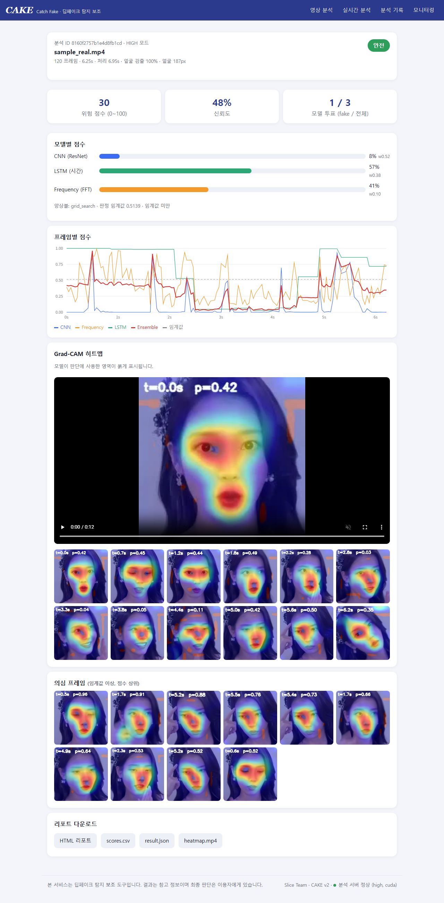
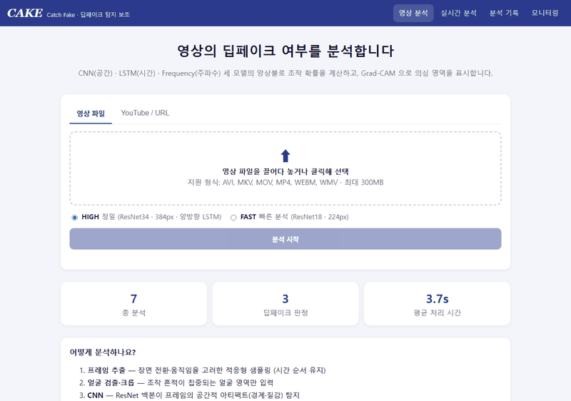
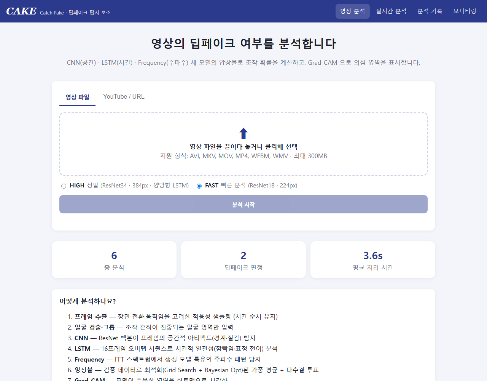
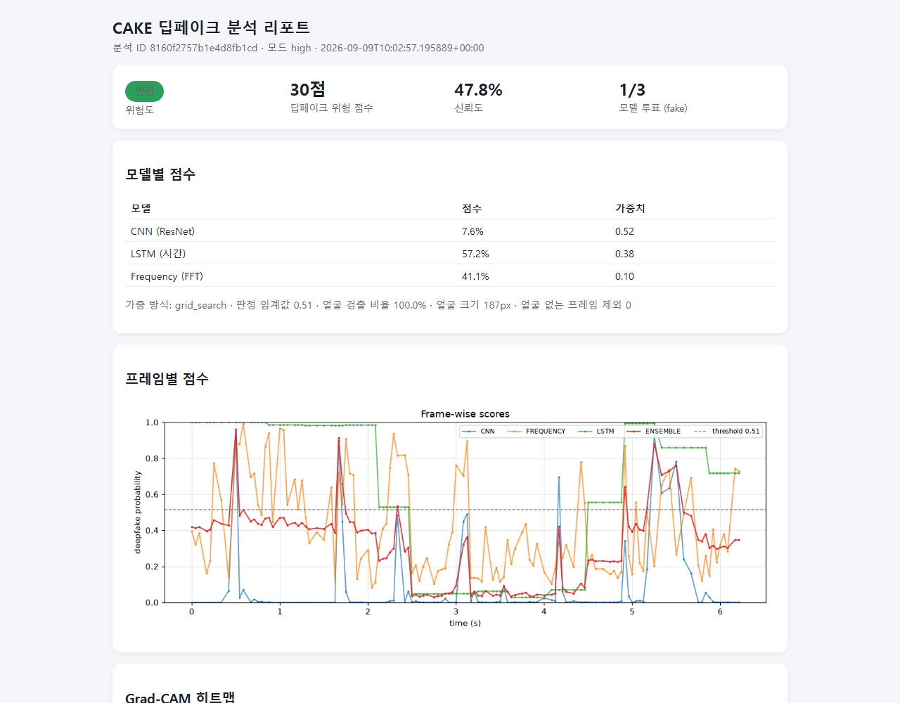
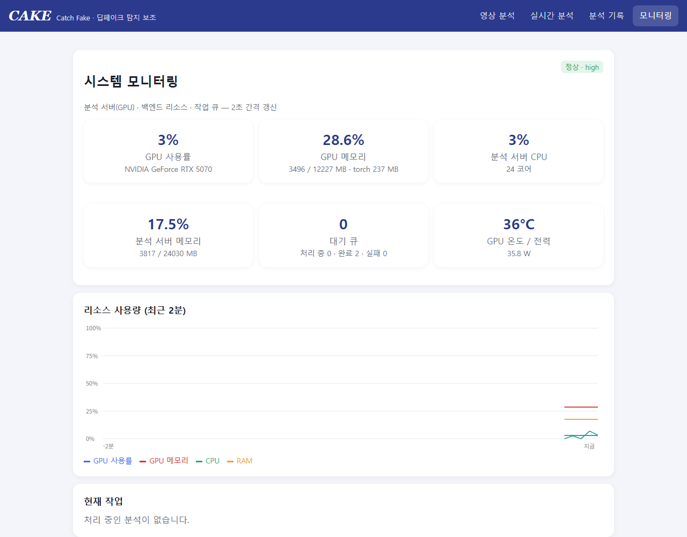
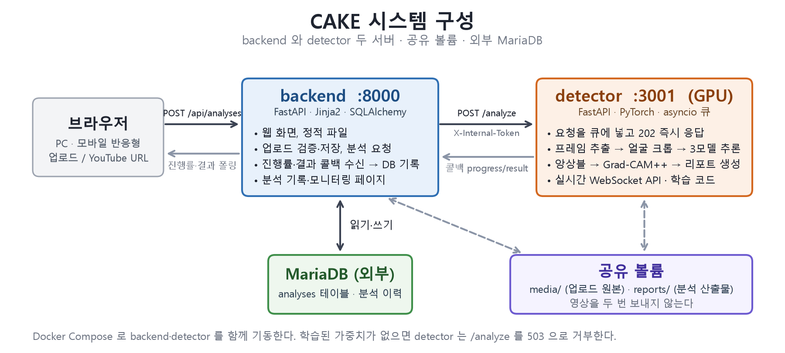
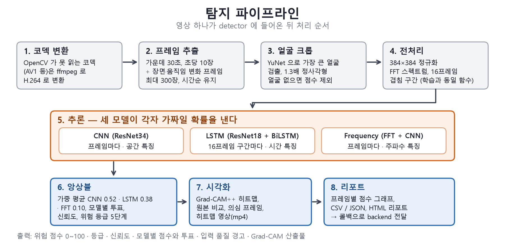
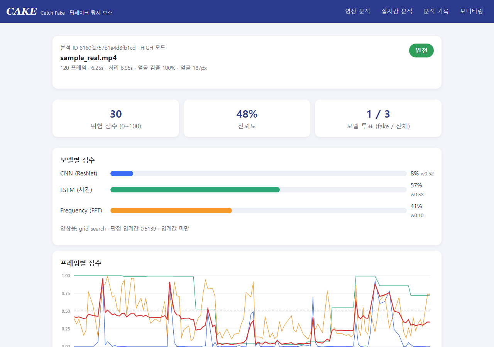
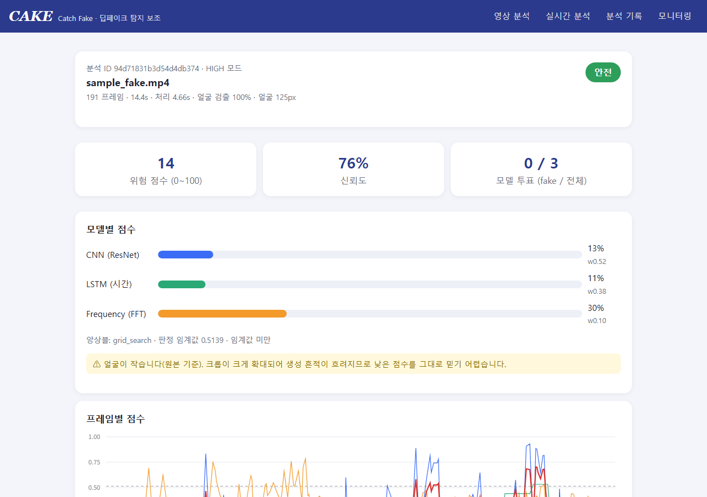
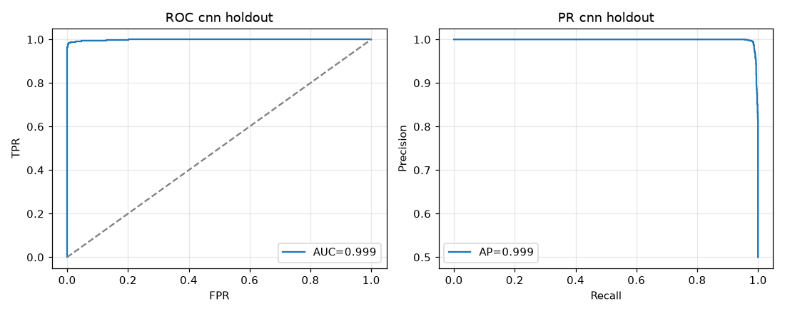

# CAKE (Catch Fake)

> 딥페이크 탐지 보조 시스템 — CNN + LSTM + FFT 하이브리드 앙상블 추론 기반
> 
> 영상 속 얼굴이 AI 로 조작되었는지, 세 가지 관점의 딥러닝 모델로 분석하고 근거를 함께 보여 주는 딥페이크 탐지 보조 시스템




## 목차

1. [프로젝트 소개](#1-프로젝트-소개)
2. [시연](#2-시연)
3. [주요 기능](#3-주요-기능)
4. [기술 스택](#4-기술-스택)
5. [시스템 구조](#5-시스템-구조)
6. [동작 과정](#6-동작-과정)
7. [성능](#7-성능)
8. [설치 및 실행](#8-설치-및-실행)
9. [프로젝트 구조](#9-프로젝트-구조)
10. [문서](#10-문서)
11. [한계와 개선 계획](#11-한계와-개선-계획)
12. [팀원](#12-팀원)
13. [참고 자료](#13-참고-자료)
14. [라이선스](#14-라이선스)

---

## 1. 프로젝트 소개

Deepfake는 원본 영상의 얼굴을 다른 사람의 얼굴로 바꾸거나 표정과 입 모양을 조작해 진짜처럼 보이는 가짜 영상을 만드는 기술이다. 생성 도구는 누구나 쓸 수 있을 만큼 쉬워졌지만, 보는 사람이 진짜와 가짜를 가려낼 방법은 마땅치 않다. 국내 딥페이크 범죄는 2021년 156건에서 2024년 297건으로 늘었다.

CAKE 는 영상 파일이나 YouTube 주소를 받아 얼굴이 조작되었을 가능성을 0~100 점의 위험 점수로 계산하고, 모델이 얼굴의 어느 부분을 보고 판단했는지 히트맵으로 보여 주는 웹 서비스다. 딥페이크의 흔적은 한 곳에만 남지 않기 때문에 프레임 한 장의 공간적 특징을 보는 CNN, 연속된 프레임의 시간적 흐름을 보는 LSTM, 주파수 스펙트럼을 보는 Frequency 모델 세 개를 따로 두고, 검증 데이터로 학습한 가중치로 결과를 합친다.

AI Hub 「딥페이크 변조 영상」 데이터셋 15,834개로 학습했고, 학습에 쓰지 않은 검증 영상 2,640개에서 정확도 98.8 % 를 얻었다. 같은 모델을 SNS 처럼 재압축한 영상에 적용한 결과(92.8 %)와, 실제 SNS 영상 8건(가짜 5, 진짜 3)에 적용한 사례도 함께 공개한다. 결과는 판단을 돕는 보조 정보이며 최종 판단은 이용자가 한다.

| 항목 | 내용 |
|---|---|
| 개발 기간 | 2025.02 ~ 2025.06 (설계·개발·실데이터 학습·발표), 2026.09 (재구축) |
| 팀 | 슬라이스(Slice) — 노태정, 이수진, 지은정 |

<!-- 링크: GitBook 주소 | 상세 문서 — 아키텍처, 파이프라인, 모델, 학습, 실험 결과 -->
<!-- 링크: velog 주소 | ✍️ 개발기 -->

---

## 2. 시연



| 화면 | 설명 |
|---|---|
| 메인 | 영상 파일을 끌어다 놓거나 YouTube 주소를 입력하고, 분석 모드(HIGH / FAST)를 선택한다. |
| 진행 | 다운로드, 프레임 추출, 전처리, 추론, 리포트 생성 순으로 진행률이 표시된다. (테스트환경 기준, FAST 모드, Grad-CAM 포함 기준 30초 영상은 약 9초) |
| 결과 | 위험 점수와 등급, 신뢰도, 모델 세 개의 점수와 투표 결과, 프레임별 점수 그래프, Grad-CAM 히트맵 영상과 의심 프레임을 보여준다 |
| 리포트 | 결과 리포트는 HTML, CSV, JSON, mp4 로 다운로드 가능하다 |
| 기록 · 모니터링 | 분석 기록을 조회하고, GPU 사용률과 작업 큐를 확인한다 |






---

## 3. 주요 기능

- **3개 모델 앙상블** — CNN(ResNet34)이 프레임의 공간 특징을, 양방향 LSTM 이 16프레임 시퀀스의 시간적 특징을, Frequency 모델이 FFT 스펙트럼의 주파수 특징을 각각 분석한다. 3개의 확률을 검증 데이터로 최적화한 가중치로 합쳐 하나의 위험 점수를 만든다.
- **근거 시각화** — Grad-CAM++ 로 CNN 이 주목한 얼굴 영역을 히트맵으로 그린다. 프레임별 히트맵, 원본과의 비교 이미지, 점수가 높은 의심 프레임, 히트맵 영상을 제공한다.
- **판단을 돕는 정보** — 모델별 투표(예: 3개 중 2개가 가짜 판정), 신뢰도, 5단계 위험 등급을 점수와 함께 보여 준다.
- **영상 전처리 자동화** — 파일(최대 300 MB)과 YouTube/HTTP 주소를 받는다. AV1 처럼 OpenCV 가 읽지 못하는 코덱은 ffmpeg 로 변환하고, 얼굴은 YuNet 으로 자동 검출해 잘라낸다.
- **입력 품질 경고** — 얼굴이 검출되지 않은 프레임은 점수에서 제외한다. 얼굴이 너무 작거나, 검출된 프레임이 적거나, 검출률이 낮으면 결과에 경고를 표시한다.
- **실시간 분석 API** — WebSocket 으로 프레임을 보내면 프레임당 14 ms(테스트환경 기준) 로 판정을 돌려준다.
- **분석 기록, 모니터링** — 분석 이력을 MariaDB 에 저장하고, GPU 사용률과 큐 상태를 대시보드로 보여 준다.
- **학습 파이프라인** — 데이터 목록 생성부터 얼굴 크롭 캐시, 교차검증, 앙상블 가중치 최적화, 홀드아웃 평가까지 스크립트 한 줄로 재현한다.

---

## 4. 기술 스택

| 분야 | 기술 |
|---|---|
| 딥러닝 | PyTorch 2.7, torchvision (ResNet18/34 사전학습), CUDA 12.8 |
| 영상 처리 | OpenCV 4.11, YuNet (얼굴 검출), ffmpeg, yt-dlp |
| 학습 · 평가 | scikit-learn (StratifiedGroupKFold, Gaussian Process, 지표), scipy, matplotlib |
| 분석 서버 | FastAPI, asyncio 큐, WebSocket |
| 서버 (backend) | FastAPI, Jinja2 서버 렌더링, SQLAlchemy, HTML/CSS/JavaScript |
| 데이터베이스 | MariaDB |
| 인프라 | Docker Compose, NVIDIA Container Toolkit, WSL2 |
| 데이터 | AI Hub 「딥페이크 변조 영상」 |

---

## 5. 시스템 구조



두 개의 서버로 구성된다. 데이터베이스 기록과 웹 페이지 구성을 맡는 **backend**, GPU 로 추론하는 **detector** 다. 별도의 **frontend** 서버는 없다.

```
브라우저 ──▶ backend (:8000) ──▶ detector (:3001, GPU) ──▶ 콜백 ──▶ backend ──▶ 브라우저
             웹 화면, 업로드,       큐에 넣고 즉시 응답,          결과를 DB 에 저장
             분석 기록(MariaDB)     추론 후 리포트 생성

             공유 볼륨  media/ (업로드 원본)  reports/ (분석 산출물)
```

| 서버 | 역할 |
|---|---|
| backend | 웹 페이지와 정적 파일을 제공하고, 업로드된 파일을 검증해 저장하고, detector 에 분석을 요청한다. 진행률과 결과를 콜백으로 받아 MariaDB 에 기록하고, 리포트를 정적 파일로 서빙한다 |
| detector | 요청을 큐에 넣고 202 로 즉시 응답한 뒤, 별도 스레드에서 프레임 추출, 얼굴 크롭, 세 모델 추론, 앙상블, Grad-CAM, 리포트 생성을 순서대로 수행한다. 학습 코드도 여기에 있다 |

추론이 오래 걸려도 웹 화면이 멈추지 않도록 서버를 나눴다. 두 서버가 같은 볼륨을 쓰기 때문에 영상 파일을 두 번 보내지 않는다. 학습된 가중치가 없으면 detector 는 분석 요청을 거부한다.

---

## 6. 동작 과정



영상 하나가 들어오면 detector 는 다음 순서로 처리한다.

| 단계 | 처리 내용 |
|---|---|
| 1. 코덱 변환 | OpenCV 가 읽지 못하는 영상은 ffmpeg 로 H.264 로 바꾼다 |
| 2. 프레임 추출 | 영상 가운데 30초에서 초당 10장 간격으로 뽑고, 장면이 바뀌거나 움직임이 큰 프레임을 추가한다. 최대 300장이며 시간 순서를 유지한다 |
| 3. 얼굴 크롭 | YuNet 으로 가장 큰 얼굴을 찾아 1.3배 넓게 정사각형으로 잘라낸다. 얼굴이 없는 프레임은 점수에서 뺀다 |
| 4. 전처리 | 384×384 로 맞추고 정규화한다. Frequency 모델용으로 FFT 스펙트럼을 만들고, LSTM 용으로 16프레임씩 겹치는 구간을 만든다. 학습 때와 같은 함수를 쓴다 |
| 5. 추론 | CNN 과 Frequency 는 프레임마다, LSTM 은 16프레임 구간마다 가짜일 확률을 낸다 |
| 6. 앙상블 | 세 확률을 가중 평균(CNN 0.52, LSTM 0.38, Frequency 0.10)하고, 모델별 투표와 신뢰도를 계산해 5단계 등급을 매긴다 |
| 7. 시각화 | Grad-CAM++ 로 CNN 이 본 영역을 히트맵으로 그린다 |
| 8. 리포트 | 프레임별 점수 그래프, CSV/JSON, HTML 리포트를 만든다 |

학습은 AI Hub 메타데이터로 데이터 목록을 만들고, 영상마다 얼굴 크롭 48장을 캐시로 저장한 뒤, 같은 인물의 영상이 학습과 검증에 나뉘어 들어가지 않도록 인물 단위로 3겹 교차검증을 돌린다. 교차검증 예측으로 앙상블 가중치를 학습하고, 학습에 쓰지 않은 검증 영상으로 최종 성능을 측정한다.

---

## 7. 성능

AI Hub 「딥페이크 변조 영상」 15,834개(진짜 7,919, 가짜 7,915, 인물 360명)로 학습했다. 아래 수치는 학습과 교차검증, 앙상블 최적화 어디에도 쓰지 않은 AI Hub 검증 영상 2,640개로 측정한 값이다.

| 모델 | AUC | 정확도 | F1 |
|---|---:|---:|---:|
| CNN (ResNet34) | 0.9987 | 98.79 % | 0.988 |
| LSTM (ResNet18 + BiLSTM) | 0.9991 | 98.64 % | 0.986 |
| Frequency (FFT + CNN) | 0.8732 | 78.90 % | 0.769 |
| **앙상블** | **0.9967** | **98.83 %** | **0.988** |

이 수치는 학습 데이터와 같은 환경에서 찍은 영상에 대한 것이다. 환경이 다른 영상에서는 다음과 같다.

| 조건 | 결과 |
|---|---|
| 검증 영상 2,640개를 SNS 처럼 H.264 로 재압축 | 정확도 92.77 %. 진짜 영상을 가짜로 잘못 판정하는 비율이 0.23 % 에서 12.35 % 로 늘었다 |
| 실제 SNS 에서 수집한 영상 8건 (가짜 5, 진짜 3) | 가짜 5건 중 4건 탐지, 진짜 3건은 모두 바르게 판정. 표본이 작고 구성(한국인 3, 외국인 4, 다수 인물 1)이 고르지 않아 비율이 아닌 사례로 본다 |

같은 인물의 진짜 영상과 가짜 영상 한 쌍의 결과 화면이다. 진짜는 30점 안전, 가짜는 59점 보통으로 둘 다 맞혔다. 가짜 쪽은 CNN 이 76 % 로 잡았고 LSTM 과 Frequency 는 기준선을 넘지 못해 투표는 1/3 이었다. 같은 인물의 60초 실내 영상(진짜, 케이크 촛불을 부는 장면)은 37점 낮음으로 맞혔지만, 촛불을 부느라 입을 오므리고 눈을 감은 구간에서 CNN 이 50 % 까지 올라 신뢰도는 41 % 였다.

같은 8건을 모델 하나만 썼을 때와 비교하면 다음과 같다. 각 모델은 자기 임계값으로 판정한다.

| 판정 주체 | 정답 | 틀린 것 |
|---|:--:|---|
| CNN 단독 | 7/8 | 가짜 1건 놓침 |
| LSTM 단독 | 5/8 | 가짜 2건 놓침, 진짜 1건 오탐 |
| Frequency 단독 | 4/8 | 가짜 3건 놓침, 진짜 1건 오탐 |
| **앙상블** | **7/8** | 가짜 1건 놓침, 오탐 0 |

앙상블은 어느 모델이 맞을지 미리 알 필요 없이 가장 좋은 단일 모델과 같은 정답을 냈고, 모델이 갈린 4건(가짜 2, 진짜 2)에서 모두 앙상블이 맞았다. 가짜 1건은 CNN 혼자 잡았고, 진짜 2건은 LSTM 과 Frequency 가 각각 한 번씩 틀렸다.

화면의 신뢰도는 실측 확률이 아니다. 점수가 0.5 에서 얼마나 떨어져 있는지와 세 모델의 점수가 얼마나 일치하는지를 합친 값이라, 점수가 30 ~ 40 이고 모델이 갈리면 50 % 아래로 나온다. 학습에 쓰지 않은 AI Hub 검증 영상에서 30 ~ 40점 구간의 실제 정답률은 84.6 %(13건)였지만, 
이 수치를 학습 데이터 밖 영상에 그대로 적용할 수는 없다. 학습 데이터 밖 진짜 영상 3건이 모두 20 ~ 40점의 애매한 구간에 떨어진 것이 이 모델의 한계다. AI Hub 검증 영상은 이 구간에 1 % 만 떨어진다.




변조 방법별 성능, 재압축에 대한 상세 분석, 임계값에 따른 변화, 처리 속도는 상세 문서에 있다. 위 수치의 측정 원본(모델별 fold·홀드아웃 지표, 앙상블 가중치·임계값, 재압축 평가)은 [docs/metrics/](docs/metrics/) 에 있다.



### 테스트 환경

| 항목 | 사양 |
|---|---|
| GPU | NVIDIA GeForce RTX 5070 12 GB (드라이버 591.86, CUDA 12.8) |
| CPU | AMD Ryzen 9 9950X3D (16코어) |
| 메모리 | 32 GB |
| OS | Windows 11 Pro + WSL2 (Ubuntu 24.04, 커널 6.6.87) |
| 컨테이너 | Docker Desktop 29.3.1, NVIDIA Container Toolkit |
| 학습 데이터 저장소 | 4 TB ext4 (WSL 마운트), 얼굴 크롭 캐시는 Docker 네임드 볼륨 |

---

## 8. 설치 및 실행

### 요구 사항

- NVIDIA GPU 와 CUDA 12.8 이상 드라이버 (RTX 5070 12 GB 에서 검증)
- Docker Desktop(WSL2) 또는 Docker Engine + NVIDIA Container Toolkit
- MariaDB (테이블은 서버가 시작할 때 자동으로 만든다)
- 학습된 가중치 4개 — `high_cnn.pt`, `high_lstm.pt`, `high_frequency.pt`, `high_ensemble.json` 을 `checkpoints/` 에 둔다. 저장소에는 포함되지 않는다

### 실행

```bash
git clone <repository-url> cake
cd cake
cp .env.example .env
```

`.env` 에 두 값을 채운다. (AI Hub 데이터로 학습할 때는 `AIHUB_DATA_DIR` 도 필요하다. 8장 학습 참고)

```
DATABASE_URL=mysql+pymysql://사용자:비밀번호@호스트:3306/cake?charset=utf8mb4
INTERNAL_API_TOKEN=   # python -c "import secrets; print(secrets.token_hex(32))"
```

```bash
docker compose up -d --build
curl localhost:3001/health # "models_loaded": true 가 나오면 http://localhost:8000 접속
```

### API

```bash
# 분석 요청
curl -F "file=@video.mp4" -F "mode=high" localhost:8000/api/analyses
# → {"id": "...", "status": "queued", "url": "/analyses/..."}

# 상태와 결과 조회
curl localhost:8000/api/analyses/<id>

# 산출물 내려받기
curl -o scores.csv localhost:8000/api/analyses/<id>/download/scores.csv
```

### 명령줄

```bash
docker compose exec detector python -m inference.cli /data/samples/video.mp4 --no-gradcam --json
```

### 학습

`data/real/`, `data/fake/` 에 영상을 넣거나 `data/manifest.csv` 를 만든 뒤 실행한다.
AI Hub 데이터셋은 detector/training/build_aihub_manifest.py 가 메타데이터 CSV 에서 manifest.csv 파일을 자동으로 만든다. 상세 규격은 docs/SETUP.md 2장에 있다.

```bash
docker compose run --rm detector python -m training.prepare_data --frames 48 --size 384 --clips 3 --clip-len 16 --clip-stride 2
docker compose run --rm detector python -m training.train --mode high --model all --folds 3 --epochs 8 --batch-size 24 --workers 12   # --workers 는 CPU 코어 수에 맞춘다
docker compose run --rm detector python -m training.ensemble_opt --mode high --min-weight 0.1
docker compose restart detector
```

AI Hub 데이터셋 전체 파이프라인은 `scripts/aihub_pipeline.sh` 로 실행한다(WSL/Linux). 데이터 위치는 `.env` 의 `AIHUB_DATA_DIR` 로 지정하며 기본값은 없다. 설치 상세, 환경 변수, API 전체 목록은 [docs/SETUP.md](docs/SETUP.md) 에 있다.

---

## 9. 프로젝트 구조

```
cake/
├─ detector/                분석 서버, 학습 코드 (PyTorch)
│  ├─ api/                  분석 요청, 상태 조회, 실시간 WebSocket, 상태 확인
│  ├─ common/               얼굴 검출, 전처리(학습·추론 공용), 프레임 추출
│  ├─ models/               CNN, LSTM, Frequency 모델 정의
│  ├─ inference/            추론 엔진, Grad-CAM, 리포트, 명령줄 도구
│  └─ training/             데이터 목록, 캐시, 학습, 앙상블 최적화, 평가
├─ backend/                 웹 서버 (FastAPI, Jinja2, SQLAlchemy)
│  ├─ app/                  라우팅, DB 모델, 설정
│  └─ web/                  템플릿, 정적 파일
├─ scripts/                 AI Hub 학습 파이프라인, 분리 실행, 스모크 테스트, GPU 벤치마크
├─ docs/                    설치 가이드, 코드 구조, 성능 측정 원본(metrics/), 이미지(images/)
├─ docker-compose.yml
├─ .env.example
└─ LICENSE
```

`checkpoints/`, `data/`, `runs/`, `reports/`, `media/`, `.env`, 발표 자료 pdf 는 git 에 포함되지 않는다.

---

## 10. 문서

| 문서 | 내용 |
|---|---|
| 상세 문서 (GitBook) | 아키텍처, 탐지·학습 파이프라인, 모델 구조, 데이터셋, 실험 결과, 한계 |
| 개발기 (velog) | 프로젝트를 왜 만들었고 무엇을 겪었는지 |
| [설치 가이드](docs/SETUP.md) | 설치, 데이터 규격, 학습 명령, API, 환경 변수 |
| [코드 구조](docs/ARCHITECTURE.md) | 함수 단위 동작 설명 |
| [성능 측정 원본](docs/metrics/) | 모델별 교차검증·홀드아웃 지표, 앙상블 가중치, 재압축 평가 JSON |
| 발표 자료 | 2025년 6월 10일 발표 슬라이드와 포스터. 저장소에 포함하지 않으며 요청 시 제공한다 |

<!-- 링크: GitBook 주소 | 위 표 "상세 문서 (GitBook)" 에 연결 -->
<!-- 링크: velog 주소 | 위 표 "개발기 (velog)" 에 연결 -->
<!-- 발표 슬라이드 pdf·포스터 pdf 는 저장소 밖(.gitignore 제외). 링크할 곳이 생기면 위 표 "발표 자료" 에 연결 -->

---

## 11. 한계와 개선 계획

### 한계

- 학습 데이터(AI Hub, 변조 방법 5종, 스튜디오 촬영)와 환경이 다른 영상에서는 탐지율이 크게 떨어진다. 실제 SNS 가짜 영상 5건 중 4건을 탐지했고, 놓친 1건은 최고 품질급 딥페이크다. 탐지한 4건 중 1건은 세 모델 가운데 CNN 만 잡았다.
- 재압축된 진짜 영상을 가짜로 잘못 판정하는 경향이 있다. 검증 영상을 SNS 처럼 재압축하면 오탐률이 0.23 % 에서 12.35 % 로 오른다.
- AI 로 얼굴을 바꾸거나 조작한 영상만 대상이다. 영화 VFX, 처음부터 생성한 영상, 음성 위조는 다루지 않는다.
- 얼굴이 128 픽셀보다 작거나 가려지거나 여러 명이 번갈아 나오면 신뢰성이 떨어진다. 프레임마다 가장 큰 얼굴 하나만 분석한다.
- 학습 데이터 밖 평가가 영상 8건(가짜 5, 진짜 3)뿐이라 비율로 말할 수 없다. 학습 데이터의 인물은 전부 한국인인데 이 8건은 한국인 3, 외국인 4, 다수 인물 1로 섞여 있어 인종의 영향도 따로 잴 수 없다. 같은 인물(한국인)의 진짜·가짜 한 쌍은 둘 다 맞혔지만, 가짜는 세 모델 중 CNN 만 잡았다.
- 얼굴을 바꿔 붙인 영상만 대상이므로 VFX 로 만든 영상에는 반응하지 않는다. SNS 에서 수집한 VFX 영상 1건은 14점이 나왔고, 딥페이크가 아니므로 위 집계에 넣지 않았다.
- 학습 데이터(스튜디오 정면 발화)에 없는 표정과 조명, 예를 들어 촛불을 부느라 입을 오므리고 눈을 감은 장면에서는 진짜 영상이라도 CNN 점수가 50 % 근처까지 올라 신뢰도가 떨어진다. 재압축 오탐과 같은 종류의 편향이다.
- 웹 화면에서 실시간 화면 캡처는 브라우저 제약으로 쓸 수 없다. 서버 API 는 동작한다.
- 결과는 보조 정보이며 법적 판단의 근거가 될 수 없다.

### 개선 계획

| 한계 | 개선 방법 | 준비 상태 |
|---|---|---|
| 재압축된 진짜 영상 오탐 | 학습 데이터의 클립을 실제 H.264 저비트레이트로 다시 인코딩한 변형본을 학습에 섞는다. 압축 흔적을 가짜의 단서로 배우지 않게 하는 것이 목적이다 | 변형본 생성 도구와 학습 옵션(`--sns-prob`)이 구현되어 있다. 변형본 31,668개를 만들어 두었고 재학습에 약 12.5 GPU 시간이 든다 |
| 학습 데이터 밖 탐지율 | FaceForensics++, Celeb-DF v2, DFDC 처럼 생성기가 다른 데이터셋을 추가로 학습한다. 실제 SNS 딥페이크를 놓친 원인이 학습에 없는 생성기였으므로 이쪽이 근본 대책이다 | 데이터셋 이용 신청이 필요하다 |
| 평가 표본 부족 | 한국인 공개 인물의 진짜 영상과 공개된 딥페이크 영상을 같은 인물끼리 짝지어 각각 20개 이상 모아, 학습 데이터와 같은 인종 조건에서 오탐률과 탐지율을 함께 측정한다 | 영상 수집만 필요하다. GPU 는 쓰지 않는다 |
| Frequency 모델의 낮은 성능 | 384 픽셀로 줄인 JPEG 대신 원본 해상도의 패치를 그대로 입력하도록 재설계한다. 리사이즈와 JPEG 저장이 고주파 단서를 지우는 것이 원인이다 | 미착수 |
| 여러 인물이 나오는 영상 | 얼굴마다 추적 ID 를 붙여 인물별로 점수를 낸다 | 미착수 |
| 장면 전환에서 LSTM 오판 | 16프레임(1.6초) 창 안에 장면 전환이나 급한 움직임이 걸리면 불연속을 합성 흔적으로 읽는다. 장면 전환 경계에서 창을 끊도록 프레임 추출과 구간 생성을 고친다 | 미착수 |
| 실시간 화면 캡처 | 브라우저에서는 불가능하므로 Android 앱을 다시 만들거나, 단말 안에서 추론하는 온디바이스 방식을 검토한다 | 미착수 |
| VFX, 처음부터 생성한 영상 | 흔적의 종류가 달라 별도 데이터와 접근이 필요하다. 발표 때부터 남은 과제다 | 미착수 |
| 신뢰도 표시 | 점수대별 실측 정답률로 신뢰도를 보정한다. AI Hub 데이터만으로 보정하면 학습 데이터 밖 영상에서 과신하게 되므로, 학습 데이터 밖 영상을 충분히 모은 뒤에 한다 | 미착수 |
---

## 12. 팀원

| 이름 | 역할 |
|---|---|
| 노태정 (팀장) | 프로젝트 총괄, AI 모델 설계와 학습, 네트워크와 서버 |
| 이수진 | 백엔드와 서버 개발, 데이터베이스와 파일 시스템 설계 |
| 지은정 | Android 앱 개발 (v1 프로젝트, 현재 저장소 미포함), UI/UX 설계, 네트워크 |

개발 도구: v2 재구축 과정에서 코드 작성과 문서 정리에 Claude Code 를 사용했다. 설계 결정, 데이터 라벨 확인, 실험 결과 해석과 검증은 팀이 했다.

<!-- 링크: 팀원 GitHub 주소 | 위 표에 GitHub 링크를 붙일 경우 -->

---

## 13. 참고 자료

- 한국지능정보사회진흥원(NIA), AI Hub 「딥페이크 변조 영상」 데이터셋 — https://www.aihub.or.kr/aihubdata/data/view.do?dataSetSn=55
- K. He et al., "Deep Residual Learning for Image Recognition," CVPR 2016 — ResNet
- S. Hochreiter, J. Schmidhuber, "Long Short-Term Memory," Neural Computation 1997 — LSTM
- A. Chattopadhyay et al., "Grad-CAM++," WACV 2018
- J. Frank et al., "Leveraging Frequency Analysis for Deep Fake Image Recognition," ICML 2020
- W. Wu et al., "YuNet: A Tiny Millisecond-level Face Detector," Machine Intelligence Research 2023
- 황재호 외, 「복합 LSTM 네트워크를 이용한 딥페이크 영상 검출」, 한국콘텐츠학회논문지, 2020

---

## 14. 라이선스

코드는 [MIT 라이선스](LICENSE)를 따른다. 학습 데이터와 학습된 가중치는 AI Hub 이용약관에 따라 재배포하지 않는다. 사전학습 모델은 torchvision ResNet(ImageNet)과 OpenCV Zoo YuNet(Apache-2.0)을 사용한다.
